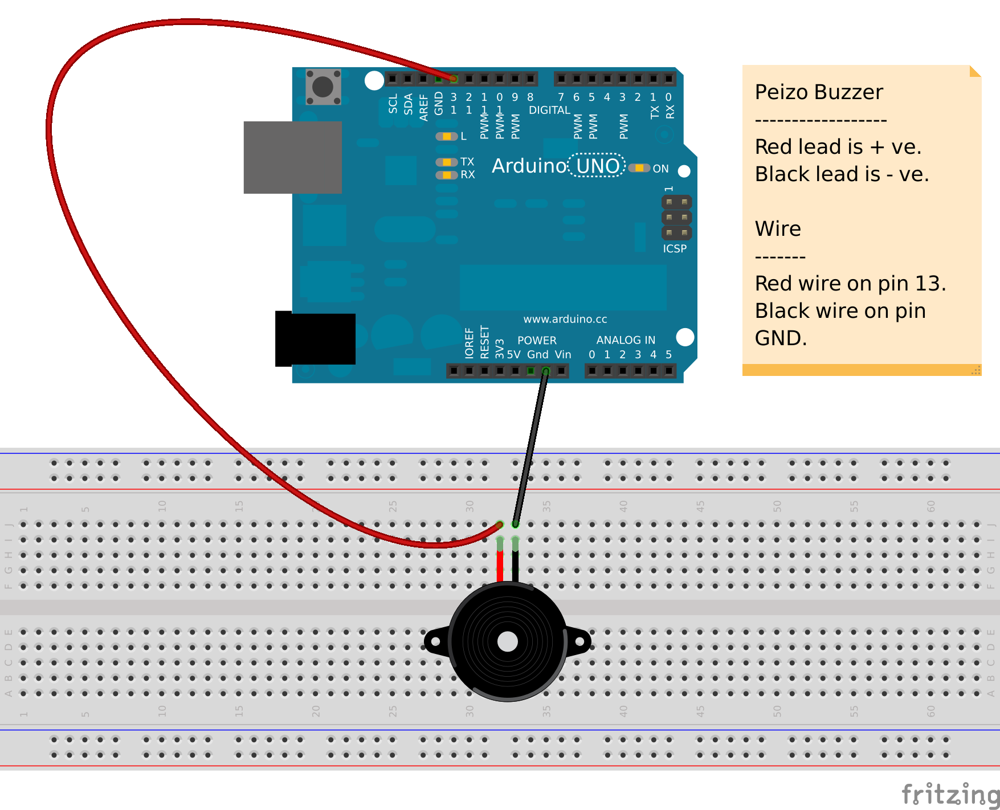

# Real time Twitter Notification

-------------

Consuming Twitter's Streaming API, this little python program will print the RT / Favorites / User mentions for the authenticating user in real time. Connecting Arduino along with a peizo-buzzer as shown below in the schematic diagram, will notify the user in real time with beeps.

### Setup

* Install the required python libraries from requirement.txt file

        sudo pip install -r requirements.txt

* Connect your Arduino board over USB and find the name of the port it is connected to (Usually this is **`/dev/ttyUSB0`** if there is only one device connected over USB).
* Open and Arduino IDE; Verify & Upload the sketch **`arduino/buzzer_notification.ino`** to the board.
* Go to http://apps.twitter.com, login and create an app by filling the form.
* Copy the `access token`, `access secret token`, `consumer key` and `consumer secret` and use those values in the file **`python/twitter_livestreaming.py`**

## Running the program

        python python/twitter_livestreaming.py /dev/ttyUSB0

You will hear beeps on the board and tweets on the screen if there are any **RT / Favorites / User mentions** on one of your tweets in real time.
